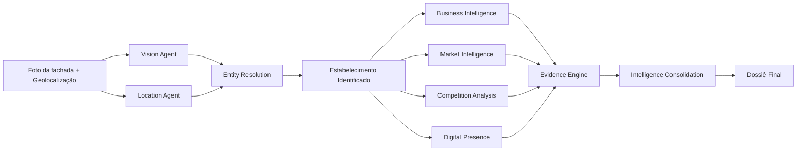
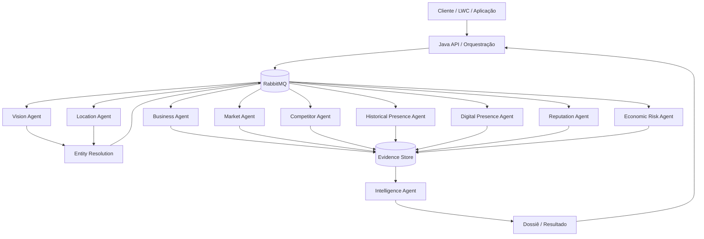

# Melhor Abordagem

Plataforma de inteligência comercial orientada a eventos para identificação, enriquecimento e análise de estabelecimentos a partir de uma **foto da fachada** e de sua **localização/geolocalização**.

O objetivo do projeto é transformar sinais iniciais simples em um dossiê comercial rastreável, composto por fatos, evidências, inferências e níveis de confiança.

> **Status atual:** fase de concepção. Neste momento o repositório contém somente documentação e diagramas. Nenhuma implementação Java foi iniciada.

## Problema que queremos resolver

A partir de uma fachada e uma localização, queremos responder perguntas como:

- Qual é o estabelecimento?
- Qual empresa está por trás dele?
- O que ele vende ou oferece?
- Há quanto tempo existem evidências de que opera naquele endereço?
- Qual é o público provável?
- Quem são os principais concorrentes na região?
- Como é sua presença digital e sua reputação?
- Quais sinais econômicos e de mercado ajudam a entender o negócio?
- Quais oportunidades comerciais podem ser inferidas com segurança?

## Visão do fluxo



## Princípio central

Nenhum agente deve transformar uma inferência em fato sem registrar evidências.

Toda informação relevante deverá carregar, sempre que possível:

- fonte;
- data de coleta;
- método de obtenção;
- nível de confiança;
- distinção entre fato observado, dado externo e inferência de IA.

Exemplo conceitual:

```json
{
  "fact": "ESTABLISHMENT_PRESENT_AT_ADDRESS",
  "value": "2019-05",
  "confidence": 0.93,
  "evidence": [
    {
      "source": "STREET_VIEW",
      "observedAt": "2019-05",
      "confidence": 0.91
    },
    {
      "source": "PUBLIC_REVIEW",
      "observedAt": "2019-08",
      "confidence": 0.84
    }
  ]
}
```

## Arquitetura conceitual

A aplicação será orientada a eventos. A API recebe o estímulo inicial e a análise é decomposta em tarefas independentes coordenadas por mensageria.



## Documentação

- [01 - Visão do Produto](docs/01-VISION.md)
- [02 - Arquitetura Conceitual](docs/02-ARCHITECTURE.md)
- [03 - Catálogo de Agentes](docs/03-AGENTS.md)
- [04 - Modelo de Evidências e Confiança](docs/04-EVIDENCE-MODEL.md)
- [05 - Escopo do MVP](docs/05-MVP.md)

## Escopo atual

Nesta fase vamos trabalhar exclusivamente com:

- documentação funcional;
- documentação arquitetural;
- diagramas Mermaid;
- contratos conceituais;
- decisões de arquitetura;
- definição de agentes;
- definição das fontes e evidências;
- refinamento do MVP.

Código Java, infraestrutura executável, filas RabbitMQ reais, bancos de dados e integrações externas ficarão para fases posteriores.
