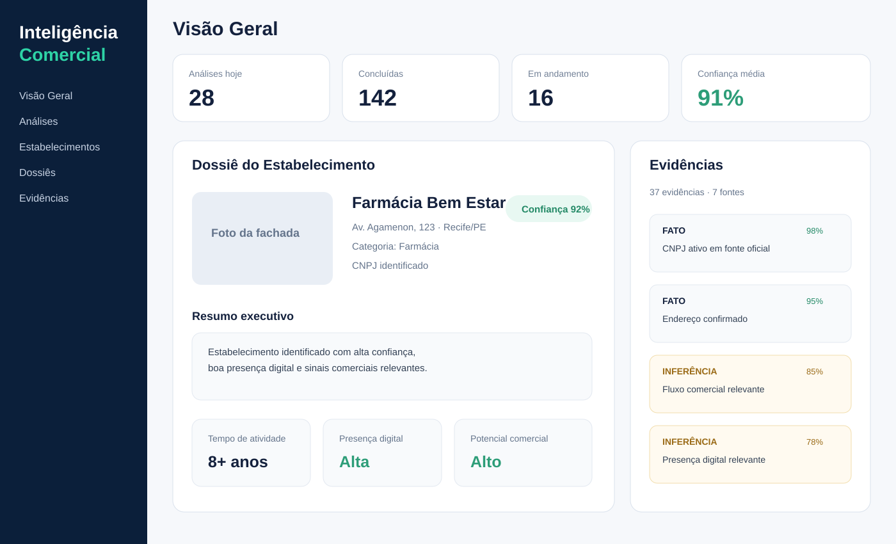
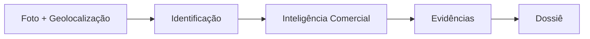
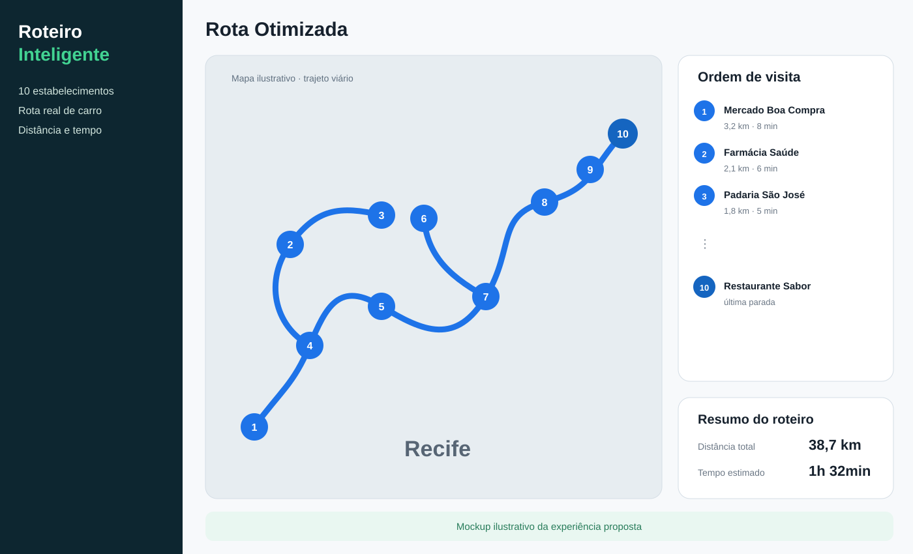
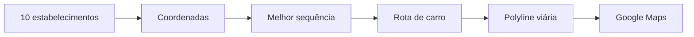
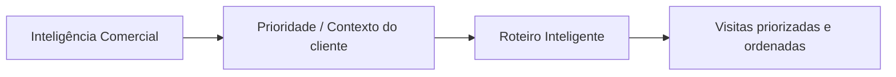

# Melhor Abordagem

Repositório de concepção funcional e arquitetural para iniciativas voltadas à melhoria da atuação comercial em campo.

> **Status atual:** documentação e diagramas. Ainda não existem implementações executáveis.

## Iniciativas

### 1. Inteligência Comercial

Identificação e enriquecimento de estabelecimentos a partir de foto da fachada e geolocalização, combinando dados empresariais, mercado, concorrência, presença digital e evidências para produzir um dossiê comercial rastreável.

➡️ [Acessar documentação de Inteligência Comercial](inteligencia-comercial/README.md)

#### Mockup





### 2. Roteiro Inteligente

Planejamento diário para visitar 10 estabelecimentos, calculando uma sequência eficiente e exibindo no Google Maps a rota real de carro, com os estabelecimentos destacados e numerados de 1 a 10.

➡️ [Acessar documentação de Roteiro Inteligente](roteiro-inteligente/README.md)

#### Mockup





## Relação entre as iniciativas

As iniciativas são independentes, mas podem se complementar no futuro. A Inteligência Comercial pode ajudar a determinar **quem merece prioridade**, enquanto o Roteiro Inteligente decide **em qual ordem visitar os clientes selecionados**.



## Estrutura

```text
melhor-abordagem/
├── README.md
├── inteligencia-comercial/
│   ├── README.md
│   ├── assets/
│   │   └── mockup.svg
│   └── docs/
│       └── ADR/
└── roteiro-inteligente/
    ├── README.md
    ├── assets/
    │   └── mockup.svg
    └── docs/
```

## Diretriz atual

Por enquanto, o trabalho permanece exclusivamente em documentação funcional, arquitetura, modelos de domínio, contratos conceituais, diagramas Mermaid, decisões de arquitetura e definição de MVPs.
