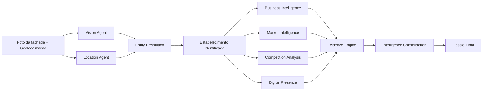
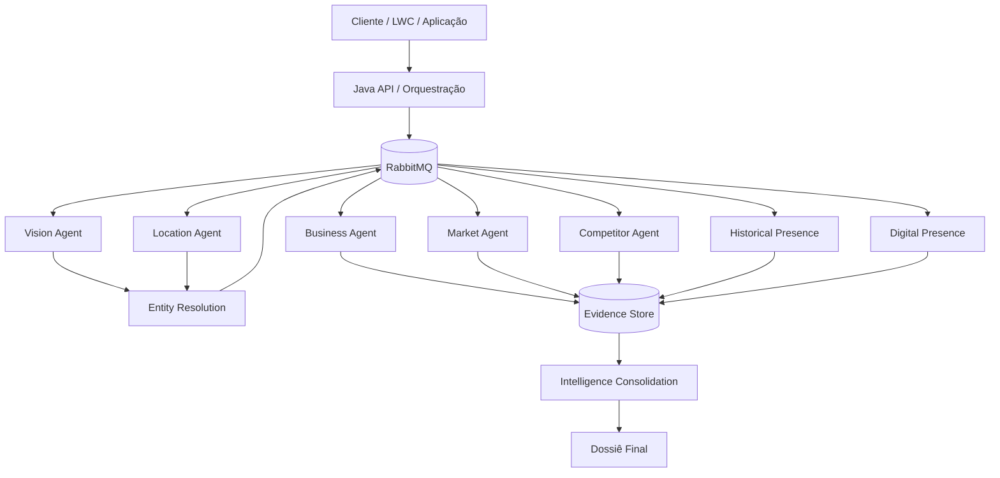

# Melhor Abordagem

Plataforma de inteligência comercial orientada a eventos para identificação, enriquecimento e análise de estabelecimentos a partir de uma **foto da fachada** e de sua **localização/geolocalização**.

O objetivo é transformar sinais iniciais simples em um dossiê comercial rastreável, composto por fatos, evidências, inferências e níveis de confiança.

> **Status atual:** fase de concepção. O repositório contém somente documentação e diagramas. Nenhuma implementação Java foi iniciada.

## Problema que queremos resolver

A partir de uma fachada e uma localização, queremos identificar o estabelecimento, compreender a empresa e o negócio, analisar contexto territorial e concorrencial, presença digital, histórico e sinais de mercado, sempre preservando evidências e incerteza.

## Visão do fluxo

## Princípio central: Evidence First

Nenhum agente deve transformar uma inferência em fato sem registrar evidências. Toda informação relevante deverá preservar, sempre que possível, fonte, data de coleta, método de obtenção, nível de confiança e distinção entre fato e inferência.

## Arquitetura conceitual

## Documentação

### Produto e arquitetura
- [01 - Visão do Produto](docs/01-VISION.md)
- [02 - Arquitetura Conceitual](docs/02-ARCHITECTURE.md)
- [03 - Catálogo de Agentes](docs/03-AGENTS.md)
- [04 - Modelo de Evidências e Confiança](docs/04-EVIDENCE-MODEL.md)
- [05 - Escopo do MVP](docs/05-MVP.md)

### Contratos e domínio
- [06 - RabbitMQ e Eventos](docs/06-RABBITMQ-EVENTS.md)
- [07 - Fontes de Dados](docs/07-DATA-SOURCES.md)
- [08 - Modelo de Domínio](docs/08-DOMAIN-MODEL.md)
- [09 - Contrato Conceitual da API](docs/09-API-CONTRACT.md)

### Governança e operação
- [10 - Segurança, Privacidade e LGPD](docs/10-SECURITY-LGPD.md)
- [11 - Observabilidade](docs/11-OBSERVABILITY.md)
- [12 - Estratégia de IA](docs/12-AI-STRATEGY.md)
- [13 - Estratégia de Custos](docs/13-COST-STRATEGY.md)
- [14 - Falhas e Retry](docs/14-FAILURE-RETRY-STRATEGY.md)

### Architecture Decision Records
- [ADR-001 - Arquitetura Orientada a Eventos](docs/ADR/ADR-001-EVENT-DRIVEN-ARCHITECTURE.md)
- [ADR-002 - Evidence First](docs/ADR/ADR-002-EVIDENCE-FIRST.md)

## Escopo atual

Nesta fase trabalharemos exclusivamente com documentação funcional e arquitetural, diagramas Mermaid, contratos conceituais, decisões de arquitetura, agentes, fontes, evidências e refinamento do MVP.

Código Java, infraestrutura executável, filas RabbitMQ reais, bancos e integrações externas ficam para fases posteriores.
