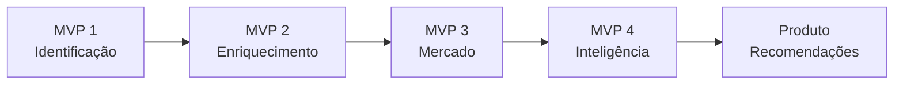

# 01 — Visão do Produto

## Visão

O **Melhor Abordagem** pretende transformar uma fotografia de fachada combinada com geolocalização em inteligência comercial estruturada e rastreável.

O sistema não deve ser apenas um mecanismo de busca. A proposta é correlacionar diferentes fontes, identificar o estabelecimento com confiança e construir progressivamente uma compreensão sobre o negócio, sua região, seu mercado e suas oportunidades.

## Entrada inicial

A análise começa com dois elementos principais:

1. fotografia da fachada do estabelecimento;
2. latitude/longitude ou localização equivalente.

Dados adicionais poderão existir no futuro, mas não devem ser obrigatórios para o fluxo principal.

## Resultado esperado

Ao final de uma análise, esperamos possuir um dossiê capaz de representar, conforme disponibilidade de evidências:

- identidade comercial do estabelecimento;
- empresa associada;
- segmento e atividade econômica;
- produtos e serviços identificados;
- endereço e contexto geográfico;
- evidências históricas de presença no endereço;
- público-alvo provável;
- concorrentes e pressão competitiva;
- presença digital;
- reputação pública;
- indicadores econômicos e mercadológicos relevantes;
- oportunidades comerciais inferidas;
- evidências que sustentam cada conclusão;
- confiança de cada informação.

## Fato x inferência

Uma premissa fundamental do produto é distinguir claramente fatos de inferências.

Exemplo:

> Encontrar uma empresa cujo CNPJ foi aberto em 2015 não comprova que o estabelecimento está no endereço atual desde 2015.

Para afirmar presença histórica no endereço, o sistema deverá procurar evidências adicionais e apresentar a conclusão como estimativa quando não houver prova determinística.

## Objetivo de negócio

A plataforma deve permitir que consumidores futuros utilizem essa inteligência para cenários como:

- preparação de abordagem comercial;
- qualificação de prospects;
- entendimento de um ponto comercial;
- inteligência territorial;
- análise de concorrência;
- identificação de oportunidades de produtos e serviços;
- suporte à tomada de decisão comercial.

## O que o produto não deve ser

O projeto não deve se tornar um mecanismo indiscriminado de investigação de pessoas físicas.

Dados de proprietários, sócios e responsáveis devem ser tratados apenas quando necessários ao contexto empresarial, observando origem, finalidade, permissões de uso e requisitos legais aplicáveis.

## Evolução

A evolução deve privilegiar qualidade e rastreabilidade antes da quantidade de informações retornadas.
