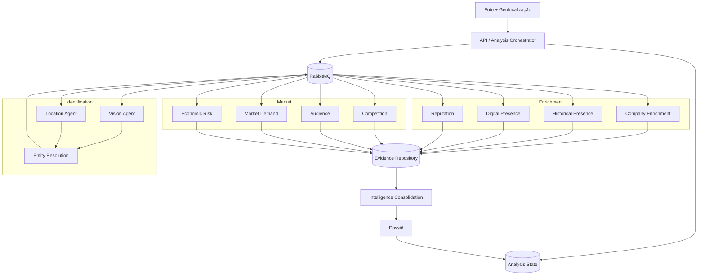
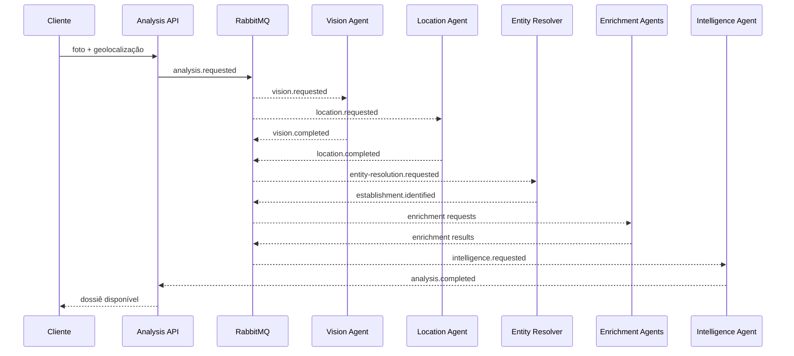

# 02 — Arquitetura Conceitual

## Objetivo

Este documento descreve a arquitetura conceitual inicial. Ele não define ainda bibliotecas, versões ou detalhes de implementação.

## Princípios

A arquitetura deverá favorecer:

- processamento assíncrono;
- baixo acoplamento entre capacidades;
- agentes especializados;
- execução paralela quando possível;
- retry independente;
- rastreabilidade ponta a ponta;
- idempotência;
- observabilidade;
- evolução incremental;
- controle de custo de IA e APIs externas.

## Visão de componentes

## Por que orientação a eventos

Algumas pesquisas podem ser independentes entre si e possuir tempos, custos e probabilidades de falha diferentes.

A mensageria permite que cada capacidade:

- seja executada separadamente;
- seja reprocessada sem reiniciar toda a análise;
- possua políticas próprias de retry;
- seja substituída futuramente;
- escale de forma independente;
- utilize modelos de IA diferentes.

## Fluxo conceitual de eventos

## Java e IA

A visão atual é utilizar Java como cérebro operacional da plataforma: contratos, workflow, estado, mensageria, segurança, persistência, auditoria e observabilidade.

Os agentes de IA são capacidades especializadas dentro desse ecossistema. A arquitetura não deverá assumir que todo processamento exige um LLM.

Sempre que uma informação puder ser obtida deterministicamente por API, banco ou regra, essa alternativa deverá ser considerada antes de utilizar IA generativa.

## Decisões ainda abertas

Ainda serão definidos em documentos/ADRs futuros:

- versão do Java;
- versão do Spring Boot;
- estratégia de orquestração;
- topologia RabbitMQ;
- persistência principal;
- armazenamento das imagens;
- cache;
- provedores de IA;
- APIs externas;
- modelo de observabilidade;
- política de custos.
