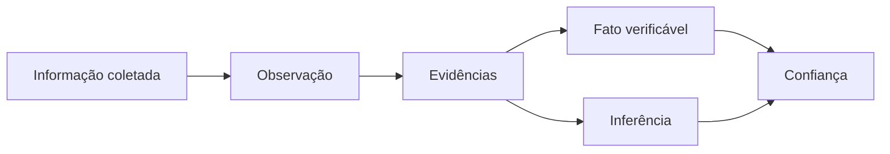

# 04 — Modelo de Evidências e Confiança

## Princípio

O sistema deve ser capaz de responder não apenas **o que sabe**, mas também:

- como sabe;
- de onde veio a informação;
- quando ela foi coletada;
- se é fato ou inferência;
- qual o nível de confiança;
- quais evidências sustentam a conclusão.

## Conceitos

### Fact

Uma afirmação estruturada sobre uma entidade.

### Evidence

Elemento utilizado para sustentar ou contradizer uma afirmação.

### Source

Origem da evidência.

### Confidence

Representação da confiança da plataforma na afirmação. Não deve ser confundida com probabilidade estatística quando não houver modelo estatístico que justifique essa interpretação.

### Observation

Algo diretamente observado em uma fonte, como um texto existente em uma fachada.

### Inference

Conclusão produzida a partir de uma ou mais observações/evidências.

## Exemplo

```json
{
  "fact": "ESTABLISHMENT_PRESENT_AT_ADDRESS",
  "value": "2019-05",
  "classification": "INFERENCE",
  "confidence": 0.93,
  "evidence": [
    {
      "sourceType": "HISTORICAL_IMAGE",
      "observedAt": "2019-05",
      "collectedAt": "2026-08-17T17:00:00Z",
      "confidence": 0.91
    },
    {
      "sourceType": "PUBLIC_REVIEW",
      "observedAt": "2019-08",
      "collectedAt": "2026-08-17T17:01:00Z",
      "confidence": 0.84
    }
  ]
}
```

## Classificação inicial



## Contradições

O modelo deve aceitar evidências contraditórias.

Uma fonte afirmar X não significa que outra fonte não possa afirmar Y. O sistema deverá preservar ambas e permitir que a camada de inteligência avalie atualidade, autoridade da fonte e consistência.

## Regra fundamental

> A ausência de evidência não deve ser convertida automaticamente em evidência de ausência.

Exemplo: não encontrar Instagram de um estabelecimento não significa afirmar que ele não possui Instagram. O resultado correto pode ser `NOT_FOUND` em vez de `DOES_NOT_EXIST`.

## Proveniência

A proveniência será parte do domínio do produto, não apenas um detalhe de logging.

Essa decisão permitirá auditoria, reprocessamento, explicabilidade e evolução dos modelos de IA sem perder a origem das informações existentes.
