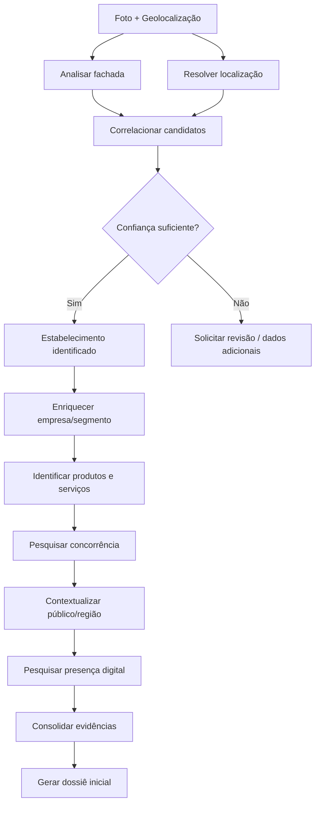

# 05 — Escopo Inicial do MVP

## Objetivo

O primeiro MVP deve provar que conseguimos partir de **foto + geolocalização** e chegar a uma identificação confiável e a um primeiro dossiê comercial rastreável.

Não devemos tentar resolver toda a visão do produto na primeira implementação.

## Fluxo proposto

## Dentro do MVP

- receber fotografia da fachada;
- receber geolocalização;
- extrair sinais relevantes da imagem;
- resolver endereço/localização;
- localizar candidatos próximos;
- correlacionar imagem e localização;
- identificar estabelecimento com nível de confiança;
- identificar segmento;
- identificar produtos/serviços quando houver evidências;
- localizar concorrentes relevantes;
- produzir contexto inicial da região/público;
- localizar presença digital empresarial pública;
- registrar fontes e evidências;
- produzir dossiê inicial.

## Fora do primeiro MVP

Devem ficar inicialmente fora, salvo mudança posterior de decisão:

- score de crédito individualizado;
- consultas pessoais invasivas;
- automação de decisões financeiras;
- previsão financeira avançada;
- recomendação automática de concessão de crédito;
- implementação de dezenas de provedores simultaneamente;
- scoring sofisticado sem dados suficientes.

## Critério de sucesso

O MVP será considerado conceitualmente bem-sucedido quando conseguirmos demonstrar que:

1. a entidade correta pode ser identificada usando múltiplos sinais;
2. as conclusões possuem evidências rastreáveis;
3. incertezas são representadas explicitamente;
4. falhas de um enriquecimento não invalidam toda a análise;
5. o resultado final agrega informação comercial útil além de uma simples busca em mapas.

## Evolução posterior

Depois do MVP poderemos adicionar gradualmente:

- histórico de presença;
- reputação avançada;
- demanda de mercado;
- pressão competitiva;
- indicadores econômicos;
- scoring de oportunidade;
- recomendações comerciais;
- comparação entre estabelecimentos;
- análise de potencial de um ponto comercial.
