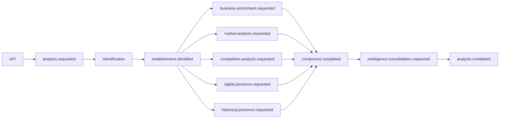

# 06 - RabbitMQ e Eventos

## Objetivo
Definir como uma análise será decomposta em etapas assíncronas, independentes e observáveis.

## Princípios
- A API inicia a análise, mas não executa todo o processo de forma síncrona.
- Cada etapa relevante publica eventos.
- Consumidores devem ser idempotentes.
- Falhas devem ser isoladas por componente.
- Mensagens carregam `analysisId`, `correlationId`, `eventId`, `occurredAt` e `schemaVersion`.

## Fluxo


## Eventos iniciais
- `analysis.requested`
- `vision.analysis.requested`
- `location.analysis.requested`
- `establishment.identified`
- `business.enrichment.requested`
- `competition.analysis.requested`
- `market.analysis.requested`
- `historical.presence.requested`
- `digital.presence.requested`
- `analysis.component.completed`
- `analysis.component.failed`
- `intelligence.consolidation.requested`
- `analysis.completed`

## Envelope conceitual
```json
{
  "eventId": "uuid",
  "eventType": "competition.analysis.requested",
  "schemaVersion": 1,
  "analysisId": "uuid",
  "correlationId": "uuid",
  "causationId": "uuid",
  "occurredAt": "ISO-8601",
  "payload": {}
}
```

## Falhas
Erros transitórios usam retry com backoff. Rate limits respeitam a janela do provider. Erros funcionais não devem ser repetidos automaticamente. Mensagens inválidas seguem para DLQ. Um provider indisponível pode fazer o componente terminar como `PARTIAL` sem necessariamente invalidar toda a análise.

## Idempotência
Reentregas não podem duplicar evidências, transições de estado ou eventos de conclusão. O `eventId` será a referência primária para controle de processamento.

## Estados
`REQUESTED -> RUNNING -> PARTIAL | COMPLETED | FAILED`
