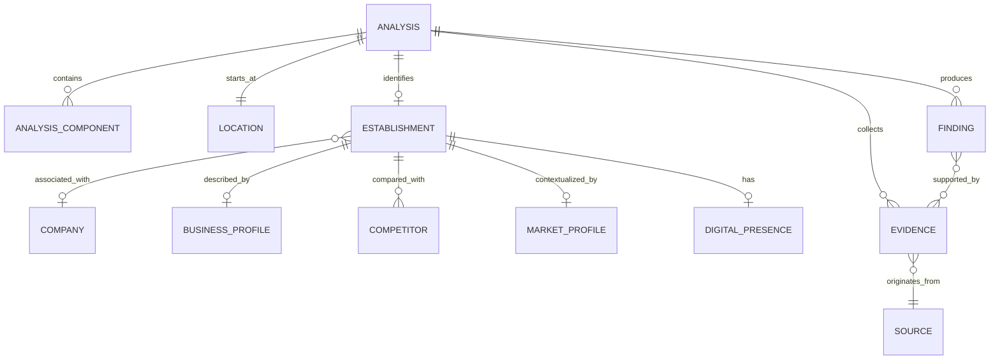

# 08 - Modelo de Domínio

## Objetivo
Definir a linguagem comum do produto antes da implementação.

## Entidades principais

- **Analysis**: execução completa iniciada por um estímulo externo.
- **Establishment**: presença comercial física observada em uma localização.
- **Company**: entidade empresarial associada ao estabelecimento quando identificável.
- **Location**: coordenadas, endereço e contexto geográfico.
- **BusinessProfile**: descrição do segmento, produtos, serviços e características do negócio.
- **Competitor**: estabelecimento comparável dentro de um contexto geográfico e comercial.
- **MarketProfile**: sinais agregados sobre mercado, região e público provável.
- **DigitalPresence**: presença pública comercial em canais digitais.
- **Evidence**: observação rastreável que sustenta uma afirmação.
- **Finding**: conclusão produzida a partir de uma ou mais evidências.
- **Source**: origem da informação.
- **AnalysisComponent**: parte independente da análise global.

## Relações

## Distinções importantes

### Establishment != Company
Uma empresa pode possuir múltiplos estabelecimentos. Uma fachada representa inicialmente uma presença física; somente depois tentamos associá-la com segurança a uma entidade empresarial.

### Evidence != Finding
`Evidence` representa algo observado ou obtido de uma fonte. `Finding` representa uma conclusão. Uma conclusão pode depender de várias evidências.

### Fact != Inference
O modelo deverá distinguir dados diretamente obtidos de fontes e inferências calculadas ou produzidas por IA.

## Aggregate inicial
`Analysis` é o candidato natural a aggregate principal do processo, pois concentra identidade, estado, componentes, evidências e resultado final. Essa decisão será validada durante o desenho técnico.
