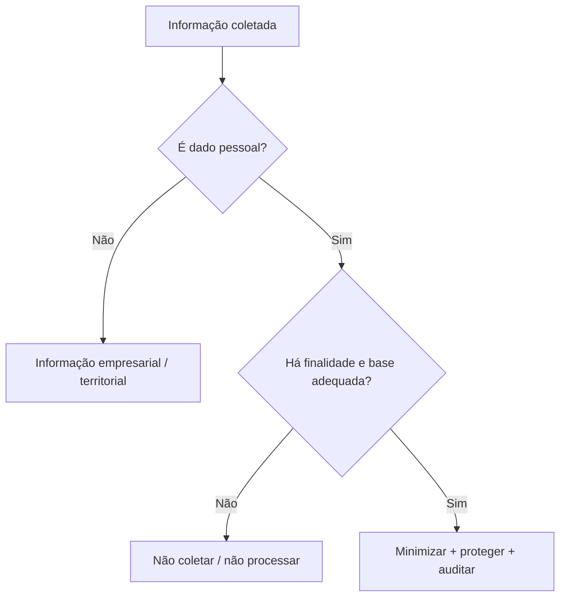

# 10 - Segurança, Privacidade e LGPD

## Objetivo
Estabelecer princípios de segurança e privacidade antes da escolha e integração das fontes de dados.

## Princípios
- minimização de dados;
- finalidade definida;
- coleta proporcional ao objetivo do produto;
- rastreabilidade de origem;
- controle de acesso;
- retenção limitada;
- proteção de dados em trânsito e em repouso;
- auditoria de operações sensíveis;
- separação entre dados empresariais e dados pessoais.

## Classificação conceitual

## Proprietários e responsáveis
O projeto não terá como objetivo construir dossiês pessoais de proprietários. Informações sobre responsáveis ou quadro empresarial somente deverão ser processadas quando necessárias à finalidade empresarial, provenientes de fontes adequadas e dentro das regras aplicáveis.

## Dados financeiros e risco
Informações individualizadas de crédito ou inadimplência não devem ser obtidas por scraping ou inferência. Caso essa capacidade seja necessária no futuro, dependerá de provider autorizado, contrato, finalidade e controles específicos.

## Imagens
Fotos de fachada podem incidentalmente conter pessoas, placas de veículos ou outros elementos pessoais. A política de tratamento, retenção e eventual minimização desses elementos deverá ser definida antes da implementação.

## Auditoria
Toda consulta sensível deverá permitir identificar quem solicitou, qual análise a originou, qual provider foi utilizado, quando ocorreu e qual finalidade foi aplicada.

## Pendências para revisão jurídica
Este documento define princípios de engenharia e não substitui validação jurídica. Antes da produção deverão ser revisados LGPD, termos dos providers, retenção, compartilhamento, direitos dos titulares e finalidade comercial concreta.
