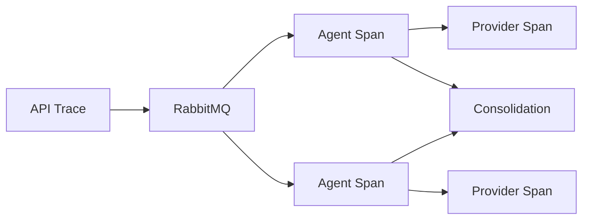

# 11 - Observabilidade

## Objetivo
Permitir compreender uma análise ponta a ponta, tanto tecnicamente quanto do ponto de vista do produto.

## Três pilares
- logs estruturados;
- métricas;
- traces distribuídos.

OpenTelemetry será considerado como padrão de instrumentação no desenho técnico futuro.

## Correlação
Toda operação deverá preservar:
- `analysisId`;
- `correlationId`;
- `eventId`;
- `component`;
- `provider` quando aplicável.

## Métricas técnicas
- duração total da análise;
- duração por componente;
- mensagens publicadas/consumidas;
- retries;
- DLQ;
- erros por provider;
- latência externa;
- rate limits;
- tamanho de fila;
- disponibilidade de providers.

## Métricas de IA
- chamadas por modelo;
- tokens de entrada/saída;
- custo estimado;
- latência;
- respostas rejeitadas por validação;
- confidence produzido versus evidência disponível;
- fallback de modelo.

## Métricas de produto
- percentual de estabelecimentos identificados;
- confidence médio de identificação;
- percentual de análises completas/parciais;
- número médio de evidências por finding;
- cobertura média por dimensão;
- custo médio por análise.

## Logs
Logs não devem armazenar indiscriminadamente imagens, payloads sensíveis, tokens, credenciais ou dados pessoais. Eventos relevantes devem ser estruturados e correlacionáveis.
