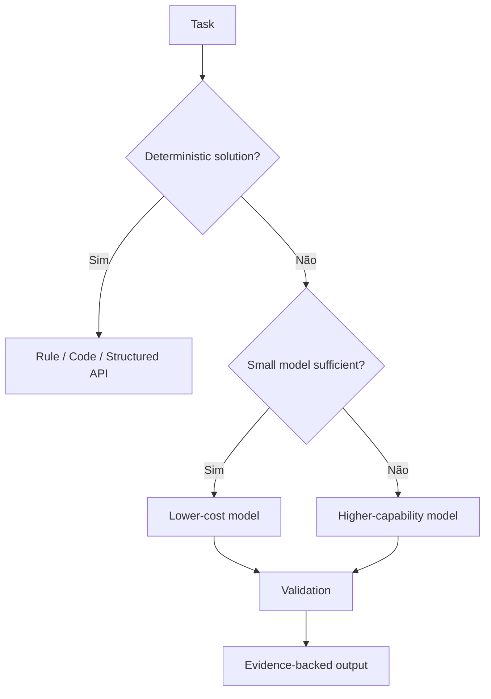

# 12 - Estratégia de IA

## Objetivo
Definir onde IA agrega valor e onde regras determinísticas, APIs ou dados estruturados são preferíveis.

## Princípio
LLM não será tratado como banco de dados nem como fonte factual. IA interpreta, classifica, relaciona e resume evidências obtidas por mecanismos rastreáveis.

## Tipos de capacidade

### Visão
Extrair textos, sinais de categoria, logotipos aparentes e características comerciais da imagem.

### Entity resolution assistido
A IA pode ajudar a comparar candidatos, mas a decisão deve considerar distância, nome, endereço, categoria e outras evidências estruturadas.

### Classificação e síntese
Transformar informações heterogêneas em perfil comercial, temas de reputação e findings compreensíveis.

### Consolidação
Produzir explicações finais somente a partir do contexto/evidências fornecidos ao modelo.

## Modelo por complexidade

## Guardrails conceituais
- saída estruturada por schema;
- validação de campos obrigatórios;
- proibição de fatos sem evidência quando o campo exigir factualidade;
- confidence não deve ser aceito cegamente do próprio modelo;
- prompts versionados;
- modelo e versão registrados por execução;
- possibilidade de fallback;
- limites de custo e tokens.

## Confidence
O confidence final deve combinar sinais do processo, e não apenas uma nota declarada pelo LLM. Exemplos: concordância entre fontes, qualidade da fonte, distância geográfica, correspondência textual e atualidade.

## Evolução
A escolha concreta de modelos será registrada em ADR e poderá variar por tarefa para otimizar custo, latência e qualidade.
