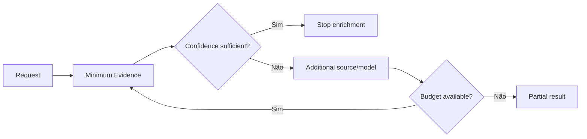

# 13 - Estratégia de Custos

## Objetivo
Tratar custo por análise como requisito arquitetural desde o início.

## Centros de custo
- modelos de visão e linguagem;
- APIs de mapas/localização;
- providers empresariais e de mercado;
- armazenamento;
- infraestrutura e observabilidade.

## Unidade econômica
A métrica principal será `costPerAnalysis`, acompanhada também por componente e provider.

## Estratégias
- cache de resultados estáveis;
- deduplicação quando permitida;
- modelos menores para tarefas simples;
- execução condicional de componentes caros;
- orçamento máximo por análise;
- rate limits por cliente;
- reutilização de evidências ainda válidas;
- medição de tokens e chamadas externas.

## Quality versus Cost

Mais chamadas não significam automaticamente melhor análise. O futuro orquestrador deverá buscar evidência suficiente dentro de limites explícitos de custo e qualidade.
