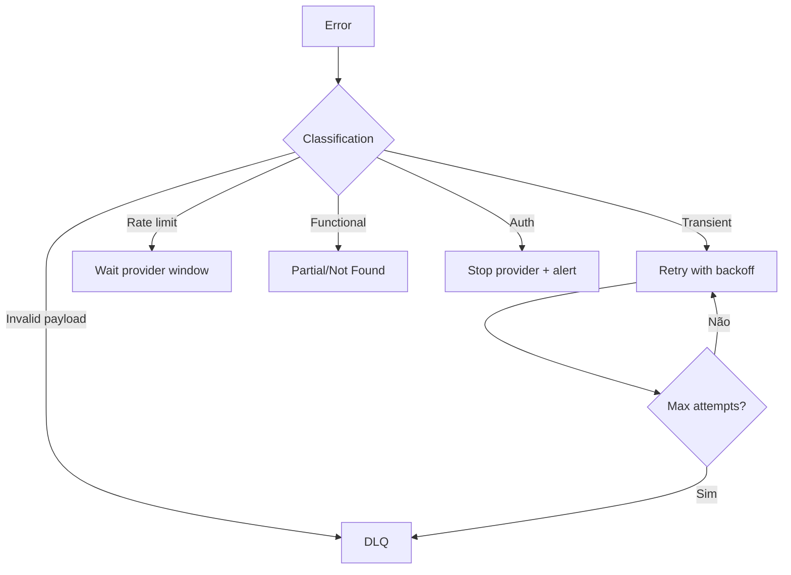

# 14 - Estratégia de Falhas e Retry

## Objetivo
Definir como o sistema deverá se comportar quando partes da análise falharem.

## Princípio
Uma fonte indisponível não deve necessariamente invalidar todo o dossiê.

## Classificação
| Tipo | Exemplo conceitual | Ação |
|---|---|---|
| Transitória | timeout | retry com backoff |
| Rate limit | quota temporária | aguardar janela |
| Funcional | entidade não encontrada | finalizar componente sem retry cego |
| Payload | mensagem inválida | DLQ |
| Autorização | credencial inválida | interromper provider e alertar |
| Qualidade | evidência insuficiente | resultado parcial |

## Fluxo

## Partial result
Uma análise parcial deve informar:
- quais componentes foram executados;
- quais falharam;
- quais fontes ficaram indisponíveis;
- impacto estimado na cobertura/confiança.

## Circuit breaker
Providers externos deverão ser candidatos a circuit breaker para impedir cascatas de timeout e consumo desnecessário.

## Time budget
Cada análise e componente deverá possuir orçamento de tempo. O sistema não deve esperar indefinidamente por uma fonte secundária.

## Reprocessamento
O desenho deverá permitir reprocessar um componente específico sem obrigatoriamente repetir toda a análise.
