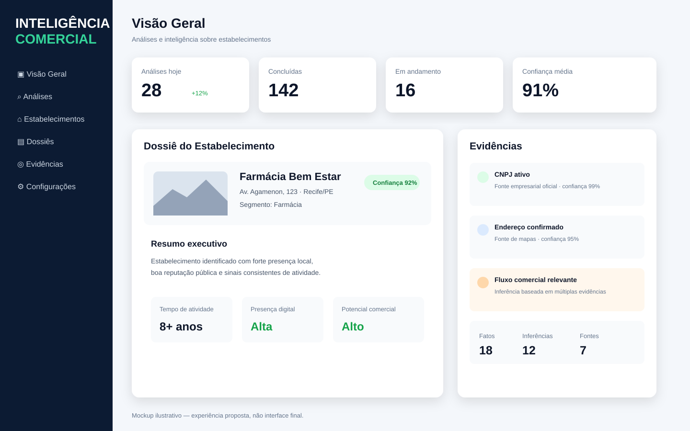
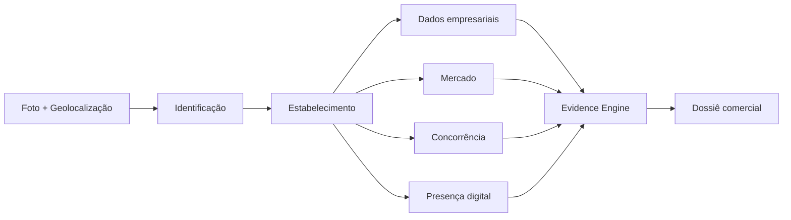

# Inteligência Comercial

Esta pasta concentra toda a documentação da iniciativa de **Inteligência Comercial**: identificação e enriquecimento de estabelecimentos a partir de foto da fachada e geolocalização, análise de mercado, concorrência, presença digital, evidências e consolidação de inteligência.

## Mockup

O mockup abaixo representa a experiência proposta para consulta de análises, dossiê do estabelecimento e evidências. É ilustrativo e não define a interface final.

## Fluxo principal

## Documentação

- [01 - Visão](docs/01-VISION.md)
- [02 - Arquitetura](docs/02-ARCHITECTURE.md)
- [04 - Evidências](docs/04-EVIDENCE-MODEL.md)
- [05 - MVP](docs/05-MVP.md)
- [06 - RabbitMQ e Eventos](docs/06-RABBITMQ-EVENTS.md)
- [07 - Fontes de Dados](docs/07-DATA-SOURCES.md)
- [08 - Modelo de Domínio](docs/08-DOMAIN-MODEL.md)
- [09 - Contrato de API](docs/09-API-CONTRACT.md)
- [10 - Segurança e LGPD](docs/10-SECURITY-LGPD.md)
- [11 - Observabilidade](docs/11-OBSERVABILITY.md)
- [12 - Estratégia de IA](docs/12-AI-STRATEGY.md)
- [13 - Estratégia de Custos](docs/13-COST-STRATEGY.md)
- [14 - Falhas e Retry](docs/14-FAILURE-RETRY-STRATEGY.md)
- [ADRs](docs/ADR/)

## Status

Fase de documentação e desenho arquitetural. Sem implementação executável neste momento.
