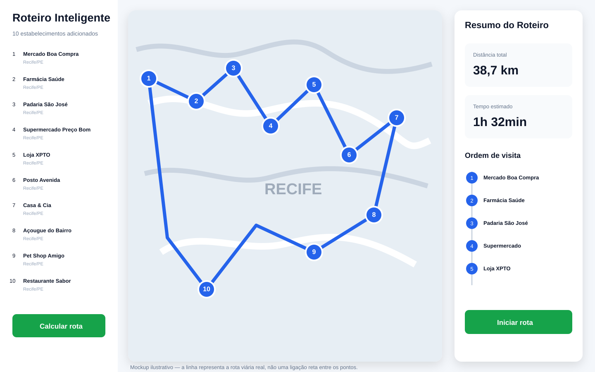
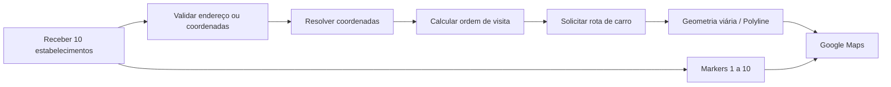

# Roteiro Inteligente

## Visão

O **Roteiro Inteligente** recebe diariamente uma lista de **10 estabelecimentos** que devem ser visitados por uma pessoa responsável, calcula uma sequência eficiente de visita e apresenta o roteiro visualmente em um **mapa do Google**, destacando cada estabelecimento e desenhando o caminho real de carro pelas ruas.

O foco inicial é simples: transformar 10 pontos comerciais em uma rota viária clara, visual e executável.

## Mockup

O mockup abaixo representa a experiência proposta para a lista de estabelecimentos, o mapa com os 10 markers numerados, a rota viária e o resumo de distância e tempo. É ilustrativo e não define a interface final.



## Experiência esperada

O mapa deve apresentar simultaneamente:

- os 10 estabelecimentos destacados;
- marcadores numerados de `1` a `10` conforme a ordem da visita;
- nome do estabelecimento ao interagir com o marcador;
- rota real de carro acompanhando ruas e avenidas;
- distância total;
- tempo estimado total;
- distância e tempo entre estabelecimentos.

A linha da rota **não é uma ligação reta entre coordenadas**. Ela representa a geometria retornada pelo serviço de rotas para o modo de deslocamento de carro e é desenhada como uma polyline sobre o mapa.

## Fluxo do MVP



## Exemplo conceitual

```text
Início
  ↓ 4,2 km / 9 min
[1] Mercado Boa Compra
  ↓ 1,8 km / 5 min
[2] Padaria São José
  ↓ 3,1 km / 8 min
[3] Farmácia Central
  ↓ ...
[10] Restaurante Avenida
```

No mapa, a linha deverá seguir as vias utilizadas por um veículo entre cada parada.

## Escopo inicial

Nesta primeira versão não estamos tentando resolver agenda complexa, prioridade comercial, janelas de atendimento ou replanejamento durante o dia. Esses recursos permanecem como possibilidades futuras.

O MVP é:

**10 estabelecimentos -> melhor sequência -> rota de carro -> Google Maps -> estabelecimentos destacados.**

## Documentação

- [01 - Visão e Requisitos](docs/01-VISION.md)
- [02 - Arquitetura Conceitual](docs/02-ARCHITECTURE.md)
- [03 - Otimização e Rota Viária](docs/03-ROUTE-OPTIMIZATION.md)
- [04 - Modelo de Domínio](docs/04-DOMAIN-MODEL.md)
- [05 - Google Maps e Dados Geográficos](docs/05-MAPS-AND-DATA-SOURCES.md)
- [06 - Regras do MVP](docs/06-CONSTRAINTS.md)
- [07 - MVP](docs/07-MVP.md)

## Status

Fase exclusivamente documental. Ainda não existem implementação ou integrações executáveis.
