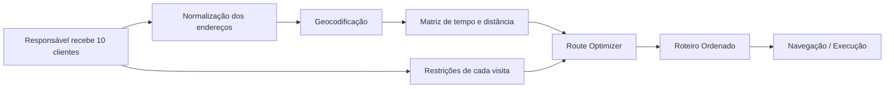

# Roteiro Inteligente

## Visão

O **Roteiro Inteligente** é a iniciativa responsável por organizar automaticamente a sequência diária de visitas de uma pessoa de campo a um conjunto de clientes.

O cenário inicial considera **10 clientes por dia**. O objetivo não é apenas encontrar a menor distância geométrica, mas gerar a melhor sequência de visitas considerando tempo, trânsito, janelas de atendimento, prioridade comercial e restrições operacionais.

## Problema

Uma lista de 10 clientes pode ser visitada em muitas ordens diferentes. A sequência escolhida afeta:

- quilômetros percorridos;
- tempo total em trânsito;
- horário de chegada;
- atrasos;
- custo operacional;
- possibilidade de concluir todas as visitas;
- qualidade do atendimento.

A otimização deverá transformar uma lista sem ordem em um itinerário executável.

## Fluxo inicial



## O que significa "melhor rota"

No MVP, a função objetivo deverá priorizar:

1. cumprir todas as visitas possíveis;
2. respeitar janelas obrigatórias de atendimento;
3. minimizar tempo total de deslocamento;
4. minimizar distância percorrida;
5. reduzir atrasos e períodos ociosos.

Posteriormente poderão entrar critérios comerciais como prioridade do cliente, oportunidade, SLA, probabilidade de conversão e valor esperado da visita.

## Exemplo

Entrada:

```text
Cliente A
Cliente B
Cliente C
Cliente D
Cliente E
Cliente F
Cliente G
Cliente H
Cliente I
Cliente J
```

Saída:

```text
08:00  Saída
08:20  Cliente F
09:05  Cliente C
09:50  Cliente A
10:40  Cliente H
...
16:30  Cliente D
```

A ordem final pode ser completamente diferente da ordem recebida.

## Documentação

- [01 - Visão e Requisitos](docs/01-VISION.md)
- [02 - Arquitetura Conceitual](docs/02-ARCHITECTURE.md)
- [03 - Modelo de Otimização](docs/03-ROUTE-OPTIMIZATION.md)
- [04 - Modelo de Domínio](docs/04-DOMAIN-MODEL.md)
- [05 - Fontes e Serviços de Mapas](docs/05-MAPS-AND-DATA-SOURCES.md)
- [06 - Regras e Restrições](docs/06-CONSTRAINTS.md)
- [07 - MVP](docs/07-MVP.md)

## Status

Fase exclusivamente documental. Ainda não existem implementação, integrações ou algoritmo definitivo escolhidos.
