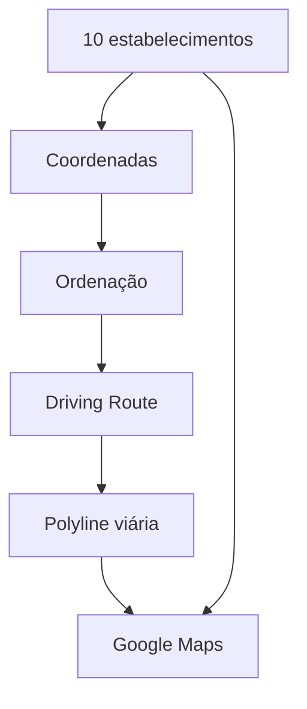

# 01 - Visão e Requisitos

## Objetivo

Receber diariamente 10 estabelecimentos, definir uma ordem eficiente para visitá-los de carro e exibir o roteiro em um mapa do Google.

## Entradas mínimas

- lista de 10 estabelecimentos;
- identificador do estabelecimento;
- nome do estabelecimento;
- endereço e/ou latitude/longitude;
- ponto inicial da rota quando disponível.

## Saída esperada

- ordem de visita de `1` a `10`;
- mapa contendo os estabelecimentos destacados;
- marcador numerado para cada estabelecimento;
- rota viária de carro entre as paradas;
- polyline acompanhando ruas e avenidas;
- distância por trecho;
- tempo estimado por trecho;
- distância total;
- tempo estimado total.

## Critérios de sucesso

- todos os 10 estabelecimentos aparecem corretamente no mapa;
- a ordem de visita é claramente identificável;
- a linha segue o caminho viário real e não liga os pontos em linha reta;
- distância e duração são apresentadas de forma compreensível;
- a solução permite abrir o roteiro diariamente para o responsável pela visita.

## Evoluções futuras

Futuramente poderão ser adicionadas janelas de atendimento, prioridades, trânsito, replanejamento, múltiplos responsáveis e integração com inteligência comercial. Esses recursos não fazem parte do escopo inicial.
