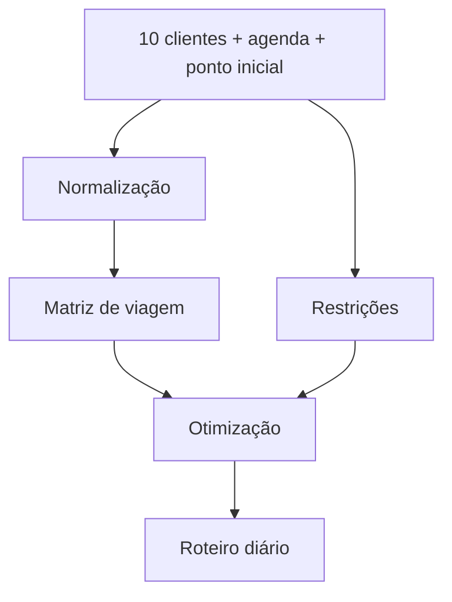

# 01 - Visão e Requisitos

## Objetivo

Gerar diariamente um itinerário otimizado para uma pessoa responsável por visitar até 10 clientes.

## Entradas mínimas

- pessoa responsável;
- ponto inicial do dia;
- lista de clientes;
- endereço ou coordenadas de cada cliente;
- duração estimada da visita;
- horário de início e fim da jornada.

## Entradas desejáveis

- janela de atendimento do cliente;
- prioridade;
- horário preferencial;
- tempo de serviço específico;
- restrições de acesso;
- compromisso fixo;
- ponto final da jornada;
- condição de trânsito prevista.

## Saída

O sistema deve produzir uma sequência ordenada de visitas com previsão de chegada, tempo de deslocamento, duração estimada e indicadores consolidados.

## Critérios de sucesso

- aumentar a probabilidade de concluir todas as visitas;
- reduzir tempo improdutivo em deslocamento;
- reduzir distância total;
- respeitar compromissos e horários;
- explicar quando uma rota não é viável;
- permitir recalcular o restante do roteiro quando o dia mudar.

## Evolução

No futuro, o roteiro poderá utilizar inteligência comercial para priorizar visitas não apenas por logística, mas também por valor potencial e contexto do cliente.
