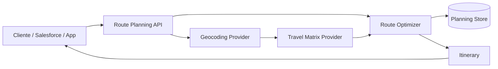
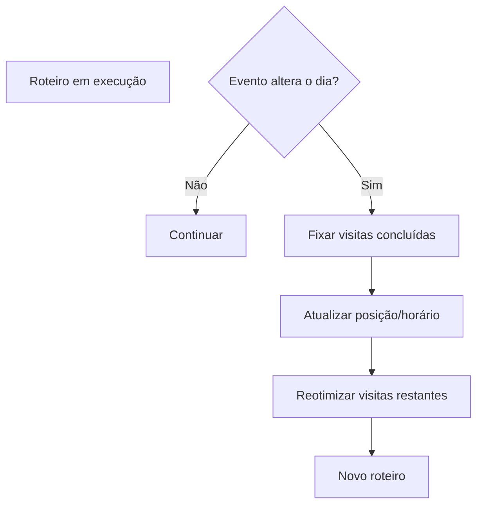

# 02 - Arquitetura Conceitual

## Visão

O Roteiro Inteligente será tratado como um domínio independente. Ele recebe uma agenda bruta, resolve os dados geográficos, calcula tempos de viagem, aplica restrições e produz o itinerário.

## Responsabilidades

### API / Application Layer
Recebe a lista de visitas, valida dados e controla o ciclo de vida do planejamento.

### Geocoding
Transforma endereços em coordenadas normalizadas e identifica endereços ambíguos.

### Travel Matrix
Calcula custo de deslocamento entre todos os pontos relevantes. O custo pode ser tempo, distância ou combinação ponderada.

### Route Optimizer
Resolve a ordem das visitas levando em conta a matriz de viagem e as restrições.

### Planning Store
Preserva entrada, roteiro gerado, parâmetros, versão do algoritmo e histórico de replanejamentos.

## Replanejamento

Eventos que podem disparar replanejamento incluem atraso, cancelamento, nova visita prioritária, mudança de horário e indisponibilidade de cliente.
