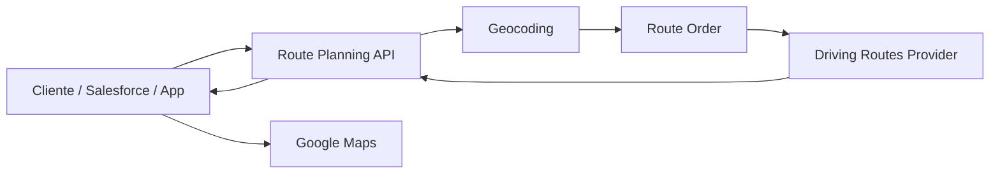
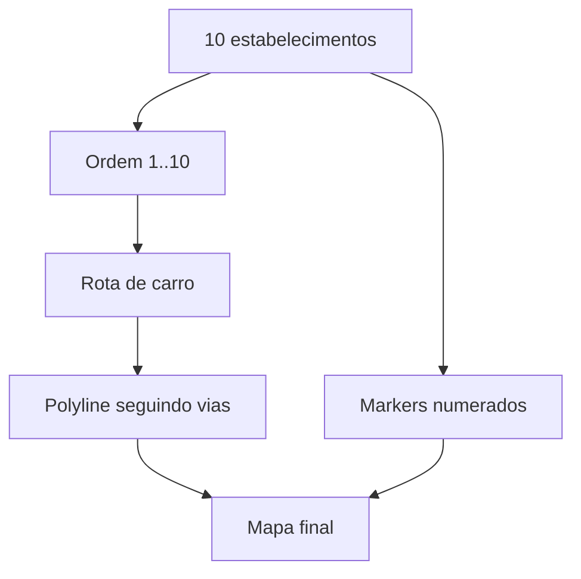

# 02 - Arquitetura Conceitual

## Visão

O Roteiro Inteligente recebe 10 estabelecimentos, resolve suas posições geográficas, define a sequência de visita, obtém a rota viária para deslocamento de carro e devolve os dados necessários para desenhar a rota no Google Maps.

## Responsabilidades

### Route Planning API
Recebe os estabelecimentos, valida os pontos, coordena o cálculo e devolve a sequência e a representação da rota.

### Geocoding
Quando a entrada possuir apenas endereço, transforma o endereço em latitude/longitude. Se as coordenadas já forem confiáveis, essa etapa pode ser evitada.

### Route Order
Define a sequência em que os 10 estabelecimentos devem ser visitados.

### Driving Routes Provider
Calcula o caminho de carro entre as paradas utilizando a malha viária. O retorno deve conter distância, duração e geometria suficiente para representação da rota.

### Google Maps
Camada visual responsável por exibir o mapa, markers numerados e a polyline da rota.

## Representação

## Separação importante

O domínio de planejamento não deve confundir **ordenação dos pontos** com **desenho do trajeto**. A ordem define `1 -> 2 -> ... -> 10`; o serviço de rotas transforma essa ordem no caminho real pelas ruas; o mapa apenas representa o resultado.
