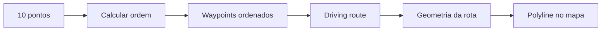

# 03 - Otimização e Rota Viária

## Problema inicial

Dado um conjunto de 10 estabelecimentos e um ponto de partida, precisamos determinar uma sequência eficiente de visita e depois obter o caminho real de carro entre esses pontos.

O MVP não considera inicialmente janelas de atendimento, prioridades comerciais ou duração da visita. Portanto, o problema inicial é significativamente mais simples que um VRPTW completo.

## Duas etapas diferentes

### 1. Ordenação
Determinar a sequência de visita:

```text
Origem -> Cliente 4 -> Cliente 1 -> Cliente 8 -> ... -> Cliente 6
```

O objetivo inicial é reduzir o custo de deslocamento, preferencialmente considerando tempo viário e/ou distância viária.

### 2. Rota viária
Com a ordem definida, solicitar ao provider de rotas o trajeto de carro entre as paradas.

O resultado deve representar ruas, avenidas, retornos e demais vias realmente utilizadas pelo veículo.



## Linha reta versus rota real

Não devemos desenhar uma linha diretamente entre as coordenadas dos estabelecimentos. Essa linha ignoraria a malha viária.

A polyline exibida no mapa deverá ser derivada de uma rota para modo de deslocamento de carro.

## Resultado esperado

Para cada trecho:

```json
{
  "from": "cliente-01",
  "to": "cliente-02",
  "distanceMeters": 3200,
  "durationSeconds": 480,
  "routeGeometry": "provider-specific-encoded-polyline"
}
```

A representação exata da geometria dependerá da API escolhida.

## Evolução

Se o produto posteriormente incorporar horários, duração de visitas, prioridades ou múltiplos responsáveis, o modelo de otimização deverá evoluir. Isso não é requisito do primeiro MVP.
