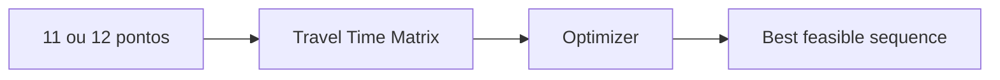

# 03 - Modelo de Otimização de Rota

## Problema

O caso se aproxima de um **Vehicle Routing Problem com Time Windows (VRPTW)** simplificado para uma pessoa/veículo e até 10 clientes por dia.

Não basta resolver o caminho geometricamente menor. O custo real depende do deslocamento viário e das restrições de atendimento.

## Variáveis relevantes

- ponto de origem;
- ponto final opcional;
- clientes a visitar;
- matriz de tempos;
- matriz de distâncias;
- duração de cada visita;
- janela de atendimento;
- prioridade;
- horário da jornada;
- compromissos fixos.

## Função objetivo conceitual

A otimização será multiobjetivo, priorizando restrições duras antes de preferências.

```text
minimize:
  travel_time
  + distance_weight * distance
  + lateness_penalty * lateness
  + idle_penalty * waiting_time
  + missed_visit_penalty * missed_visits
```

Os pesos definitivos deverão ser calibrados por negócio.

## Restrições duras e flexíveis

### Duras
Não podem ser violadas sem declarar rota inviável.

Exemplos: jornada máxima e cliente disponível somente em intervalo obrigatório.

### Flexíveis
Podem ser violadas mediante penalidade.

Exemplos: preferência por manhã ou prioridade relativa entre clientes.

## Matriz de deslocamento

Para 10 clientes, mais origem e eventual destino, o otimizador trabalha sobre custos entre pares de pontos.



## Algoritmo

A tecnologia definitiva ainda não está escolhida. Devem ser avaliadas abordagens de otimização combinatória apropriadas ao VRP/VRPTW. Com apenas 10 visitas, também é possível comparar soluções exatas ou quase exatas com heurísticas e medir qualidade versus tempo de cálculo.

## Explicabilidade

O resultado deve explicar pelo menos:
- distância estimada;
- tempo estimado de deslocamento;
- tempo de atendimento;
- espera prevista;
- atrasos;
- visitas não encaixadas;
- restrições que influenciaram a ordem.
