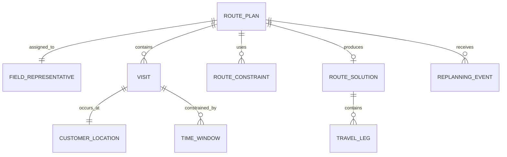

# 04 - Modelo de Domínio

## Entidades principais

- **RoutePlan**: planejamento diário de visitas.
- **FieldRepresentative**: responsável pelo roteiro.
- **Visit**: compromisso de visita a um cliente.
- **CustomerLocation**: endereço/coordenadas do cliente.
- **TimeWindow**: intervalo permitido ou preferido para atendimento.
- **TravelLeg**: deslocamento entre duas visitas.
- **RouteConstraint**: regra aplicada ao planejamento.
- **RouteSolution**: sequência otimizada resultante.
- **ReplanningEvent**: evento que altera o roteiro durante o dia.

## Relações

## Estados conceituais

`DRAFT -> READY -> OPTIMIZED -> IN_PROGRESS -> COMPLETED`

Estados alternativos: `PARTIAL`, `INFEASIBLE`, `CANCELLED`.

## Observação
O modelo deve manter separado o que foi solicitado, o que foi otimizado e o que efetivamente aconteceu em campo. Isso permitirá comparar planejamento versus execução no futuro.
