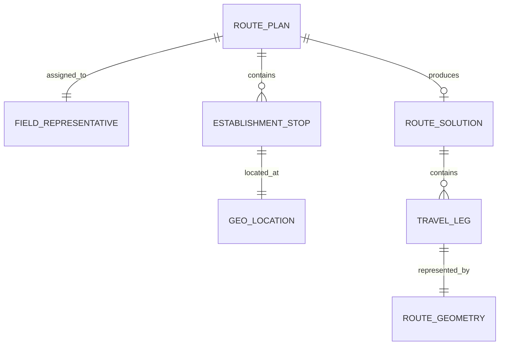

# 04 - Modelo de Domínio

## Entidades principais

- **RoutePlan**: planejamento diário contendo os 10 estabelecimentos.
- **FieldRepresentative**: pessoa responsável pelas visitas.
- **EstablishmentStop**: estabelecimento que será visitado.
- **GeoLocation**: endereço e/ou coordenadas do estabelecimento.
- **RouteSolution**: sequência final das paradas.
- **TravelLeg**: trecho viário entre duas paradas consecutivas.
- **RouteGeometry**: representação geométrica do trajeto utilizada para desenhar a polyline.

## Relações



## EstablishmentStop

Conceitualmente deve possuir pelo menos:

```json
{
  "id": "cliente-01",
  "name": "Mercado Boa Compra",
  "address": "Rua Exemplo, 123",
  "latitude": -8.0,
  "longitude": -34.0,
  "visitOrder": 1
}
```

## TravelLeg

Representa um deslocamento real de carro:

```text
Cliente 1 -- 3,2 km / 8 min --> Cliente 2
```

Além da distância e duração, deverá ser possível armazenar ou referenciar a geometria retornada pelo provider de rotas.

## RouteSolution

Deve conter:

- ordem `1..10`;
- trechos entre paradas;
- distância total;
- duração total estimada;
- geometria necessária para visualização.
