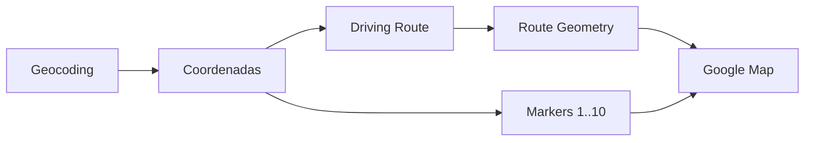

# 05 - Google Maps e Dados Geográficos

## Objetivo

Definir as capacidades de mapas necessárias para exibir os 10 estabelecimentos e uma rota real de carro entre eles.

## Capacidades necessárias

- exibir mapa interativo;
- exibir markers dos estabelecimentos;
- numerar markers de `1` a `10`;
- geocodificar endereços quando necessário;
- calcular rotas para modo de deslocamento de carro;
- obter distância e duração;
- obter geometria da rota;
- desenhar polyline acompanhando as vias.

## Google Maps

Para o MVP, a experiência visual desejada é baseada no Google Maps. A seleção exata das APIs/SDKs da Google Maps Platform deverá ser validada na fase técnica conforme plataforma cliente, preços e capacidades vigentes.

A arquitetura deve separar três responsabilidades:

## Polyline

A polyline não será criada conectando latitude/longitude diretamente. Ela deverá utilizar a geometria do trajeto viário calculado pelo serviço de rotas.

Isso permite representar corretamente:

- curvas;
- avenidas;
- ruas de mão única;
- retornos;
- acessos;
- demais características consideradas pelo mecanismo de rotas.

## Dados de entrada

Idealmente cada estabelecimento já terá latitude e longitude. Quando apenas o endereço estiver disponível, será necessária geocodificação.

## Dados de saída do provider

O contrato interno deverá normalizar pelo menos:

- origem;
- destino;
- distância;
- duração;
- geometria/polyline;
- identificação do provider;
- horário do cálculo quando relevante.

## Evolução

Trânsito em tempo real, previsão por horário e providers alternativos podem ser avaliados posteriormente. O primeiro objetivo é produzir corretamente a rota de carro e sua representação no mapa.
