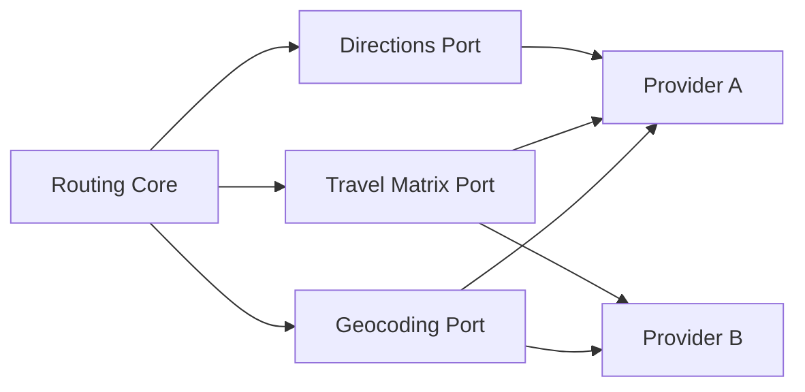

# 05 - Mapas e Fontes de Dados

## Objetivo

Definir os dados externos necessários para construir rotas baseadas em deslocamento real e não apenas em distância em linha reta.

## Capacidades necessárias

- geocodificação de endereços;
- reverse geocoding quando houver coordenadas;
- matriz de tempo e distância entre pontos;
- rotas viárias;
- estimativa de trânsito quando disponível;
- atualização de tempos durante replanejamento.

## Providers

A escolha do provider ainda não está fechada. Devem ser avaliadas alternativas como Google Maps Platform, HERE, Mapbox, OpenStreetMap/OSRM e outros serviços compatíveis com os requisitos do projeto.

## Critérios de escolha

- qualidade das rotas no Brasil;
- cobertura;
- trânsito em tempo real ou previsto;
- limites de uso;
- custo por requisição;
- SLA;
- licenciamento e regras de armazenamento/cache;
- capacidade de matriz origem-destino;
- latência.

## Estratégia

O domínio do projeto não deverá depender diretamente de um provider específico. A arquitetura futura deverá permitir trocar implementações de geocoding, matrix e directions por adaptadores.

