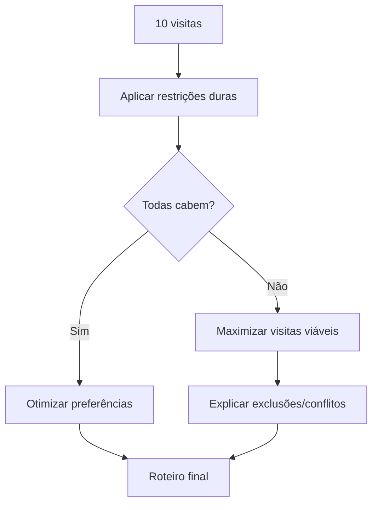

# 06 - Regras e Restrições

## Objetivo

Catalogar as restrições que podem alterar a ordem ótima das visitas.

## Restrições duras

Devem ser atendidas obrigatoriamente ou a rota deve ser marcada como inviável/parcial.

- horário de início e fim da jornada;
- cliente disponível somente em uma janela obrigatória;
- compromisso com horário fixo;
- visita que exige duração mínima;
- ponto inicial conhecido;
- visita cancelada ou indisponível.

## Restrições flexíveis

Podem ser violadas mediante penalidade.

- cliente prefere manhã ou tarde;
- cliente com prioridade comercial maior;
- evitar horário de pico em determinada região;
- reduzir retorno à mesma região;
- minimizar tempo ocioso;
- preferência por finalizar próximo a determinado ponto.

## Prioridade comercial

No primeiro MVP a prioridade será um parâmetro simples. Em versões futuras ela poderá vir de inteligência comercial, SLA, oportunidade, risco de churn ou valor potencial.

## Duração da visita

Cada visita deve possuir tempo estimado de atendimento. Sem isso, uma rota aparentemente possível pode ultrapassar a jornada.

## Rota inviável

O otimizador não deve esconder conflitos. Quando todas as 10 visitas não couberem na jornada, o resultado deverá indicar:

- visitas encaixadas;
- visitas não encaixadas;
- restrições responsáveis;
- sugestão de menor mudança necessária quando possível.

