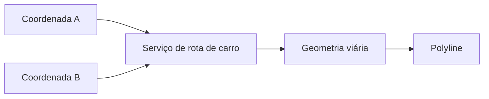

# 06 - Regras do MVP

## Objetivo

Registrar somente as regras necessárias para a primeira versão do Roteiro Inteligente.

## Regras

1. O roteiro recebe 10 estabelecimentos.
2. Cada estabelecimento precisa possuir endereço válido e/ou latitude/longitude.
3. Deve existir uma ordem de visita de `1` a `10`.
4. A rota deve considerar deslocamento de carro.
5. O caminho exibido deve seguir a malha viária.
6. Cada estabelecimento deve ser destacado no mapa.
7. Os markers devem refletir a ordem calculada.
8. Devem ser apresentados distância e tempo estimados.
9. Uma coordenada inválida ou endereço não resolvido deve ser explicitamente informado; o sistema não deve posicionar silenciosamente um cliente no local errado.

## Fora do escopo inicial

- janela de atendimento;
- duração de visita;
- prioridade comercial;
- SLA;
- horário fixo;
- replanejamento automático;
- múltiplos responsáveis;
- acompanhamento GPS;
- navegação turn-by-turn própria.

## Regra visual fundamental

Não utilizar `A -> B` como uma linha geométrica reta para representar deslocamento.

## Falhas mínimas

O planejamento deve informar quando:

- endereço não puder ser geocodificado;
- coordenada estiver ausente ou inválida;
- rota de carro não puder ser calculada;
- um estabelecimento não puder ser incluído no roteiro.
