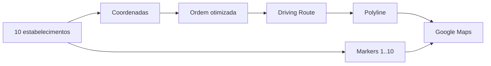

# 07 - MVP

## Objetivo

Validar a geração e visualização de um roteiro diário de carro para 10 estabelecimentos.

## Entrada

- responsável pelo roteiro;
- ponto inicial quando disponível;
- 10 estabelecimentos;
- nome de cada estabelecimento;
- endereço e/ou latitude/longitude.

## Processamento

1. validar os 10 pontos;
2. geocodificar endereços quando necessário;
3. obter dados viários necessários para comparar deslocamentos;
4. calcular uma ordem eficiente de visita;
5. solicitar a rota de carro para os waypoints ordenados;
6. obter a geometria do trajeto;
7. preparar markers numerados;
8. exibir tudo no Google Maps.

## Saída

- mapa com os 10 estabelecimentos;
- markers numerados na ordem da visita;
- linha da rota acompanhando ruas e avenidas;
- sequência textual das visitas;
- distância entre paradas;
- duração estimada entre paradas;
- distância total;
- duração total estimada.

## Critério visual de aceite

Se a rota entre dois estabelecimentos exigir contornar um quarteirão, utilizar uma avenida ou realizar um retorno, a linha exibida deve representar esse trajeto. Uma linha reta entre os dois markers não atende ao requisito.

## Fora do MVP

- horários e janelas de atendimento;
- duração das visitas;
- prioridades comerciais;
- replanejamento em tempo real;
- múltiplos vendedores;
- GPS contínuo;
- navegação própria curva a curva;
- inteligência artificial para priorização.

## Métricas iniciais

- 10/10 estabelecimentos corretamente posicionados;
- 10/10 markers corretamente numerados;
- rota viária renderizada sem segmentos retos artificiais entre os clientes;
- distância total calculada;
- duração total estimada;
- tempo de geração do roteiro.
